# Tiles

## Installation

Download the repository
```commandline
git clone https://github.com/Babdus/tiles.git
```
If you don't have poetry installed, please visit [poetry documentation](https://python-poetry.org/docs/)

If you have poetry installed, just run
```commandline
cd tiles/
poetry install
```

## Play

```commandline
poetry run python tiles.py 6
```
and enjoy!

You can set the number of tiles per row (and column, because the grid is always square) instead of `6`

## Rules

Start clicking on the tiles and finding matching shapes (the whole tile is composed of many overlayed shapes).
You can try to go on without mistakes as long as you can.
If you are on an empty tile, you can go anywhere without losing your current streak.
The goal is to empty the whole grid.

## Gallery

Every other game is randomized and is unique. here are some examples:

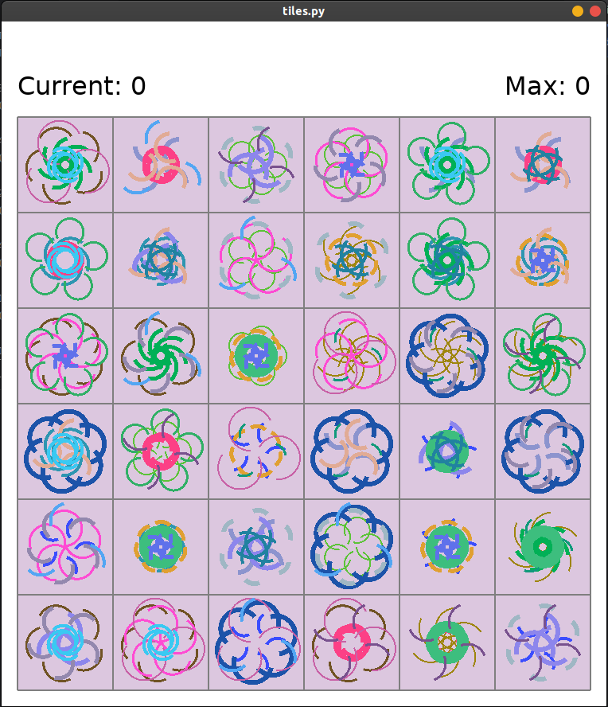
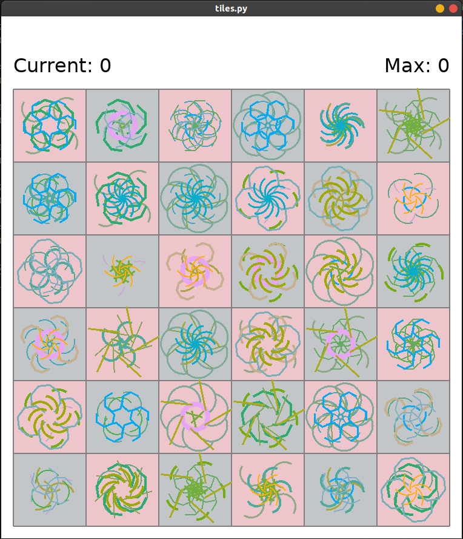
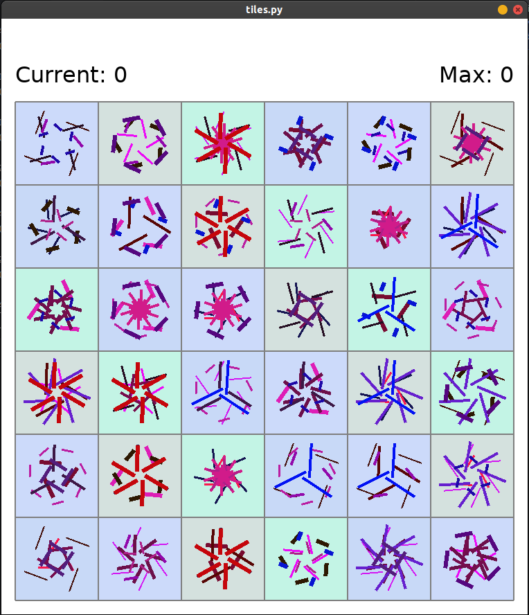
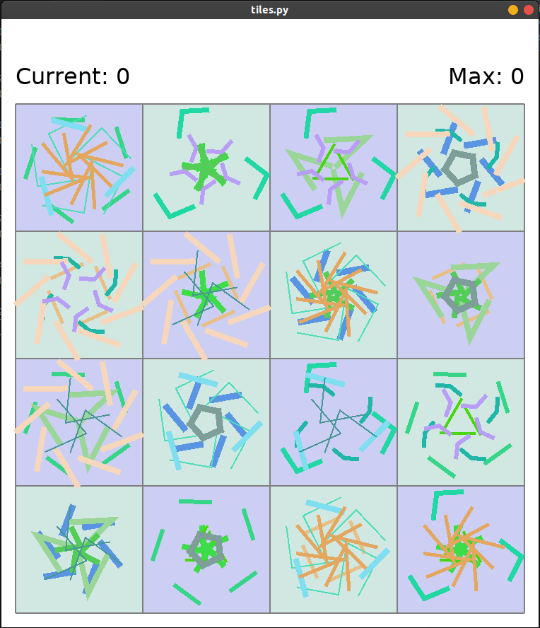
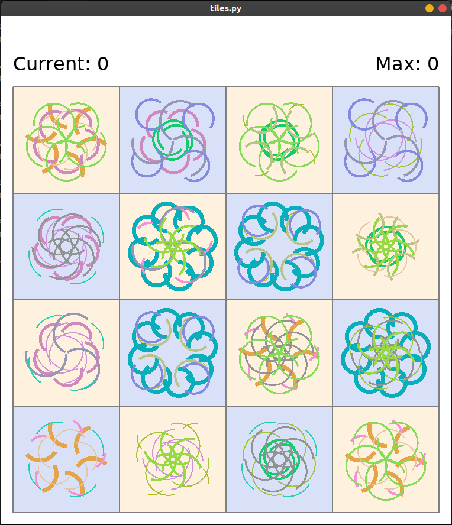
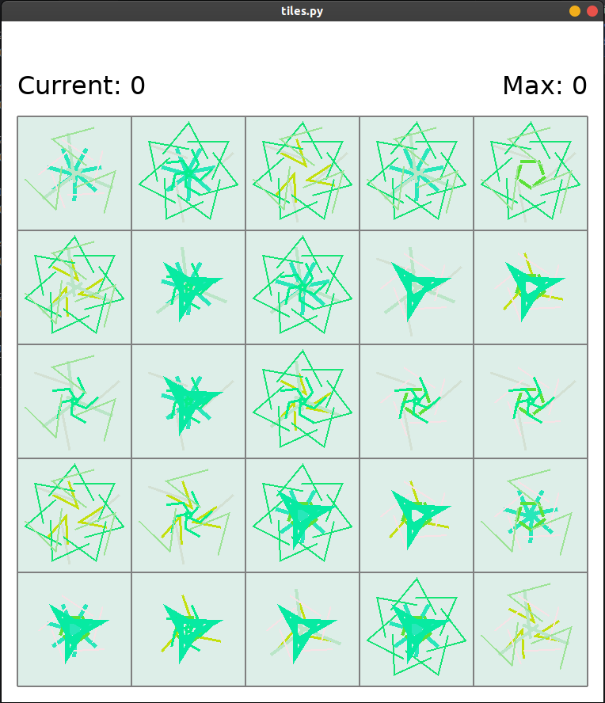
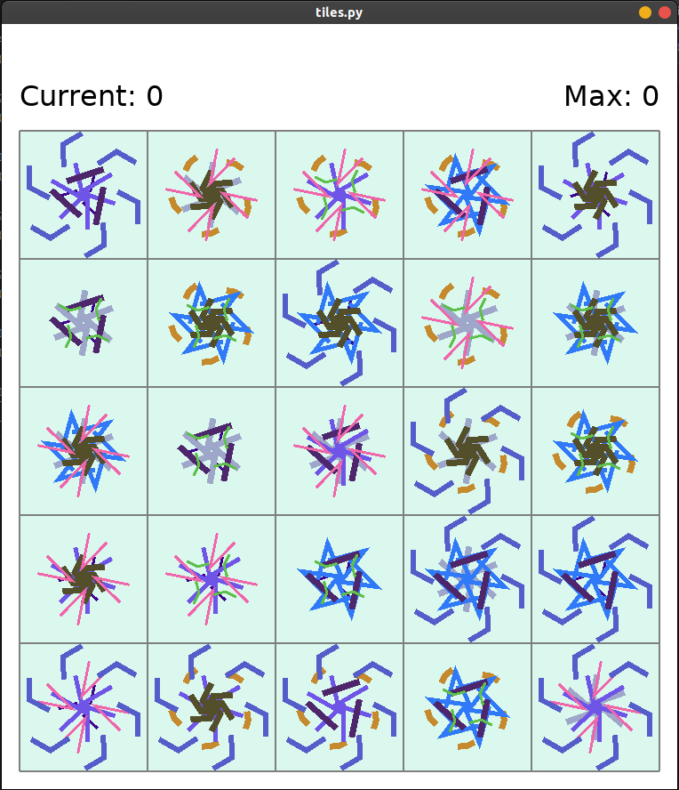
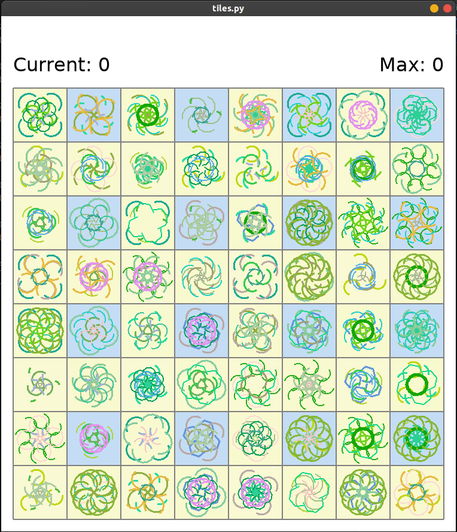
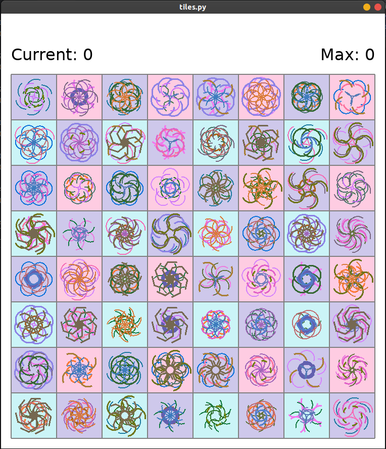
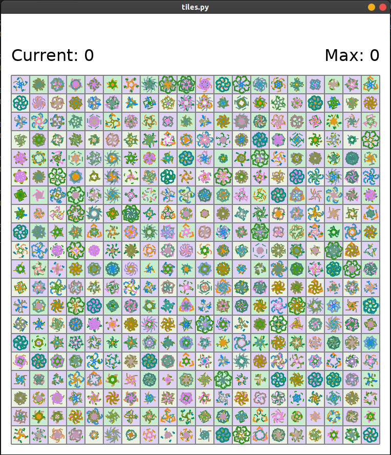
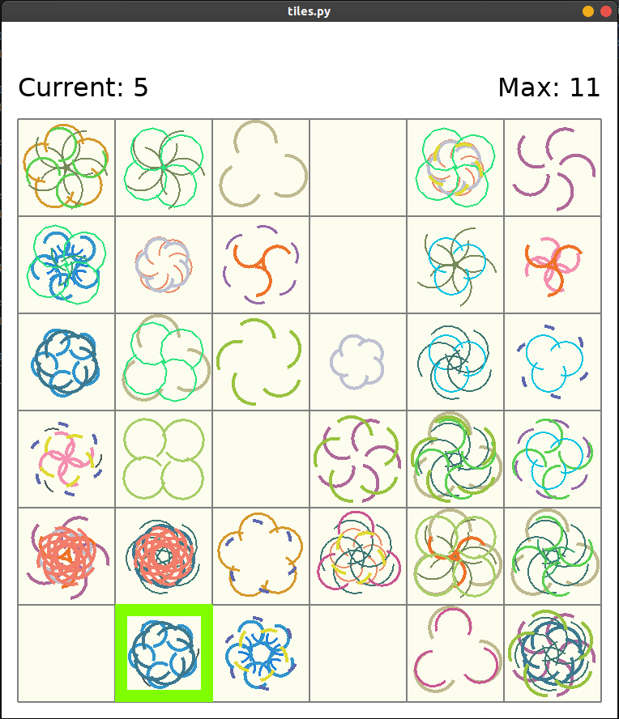
